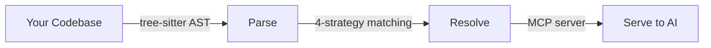

# CodeRAG CLI

**Build knowledge graphs from your codebase for smarter AI coding assistants**

---

CodeRAG parses your codebase using tree-sitter AST analysis, builds a rich knowledge graph of symbols and relationships, and serves that intelligence to AI coding assistants via an MCP server. It understands classes, functions, routes, components, cross-language connections, and framework patterns — giving your AI tools deep structural awareness instead of naive file reading.

## :sparkles: Key Features

- :globe_with_meridians: **7 Languages** — PHP, JavaScript, TypeScript, Python, CSS, SCSS + Vue SFC
- :building_construction: **11 Framework Detectors** — Laravel, Symfony, React, Express, Next.js, Vue, Angular, Django, Flask, FastAPI, Tailwind CSS
- :robot: **MCP Server** — 16 tools for Claude Code, Cursor, and Codex CLI integration
- :bar_chart: **Graph Analysis** — PageRank, community detection, blast radius, dependency graphs
- :mag: **Hybrid Search** — FTS5 full-text + FAISS vector semantic search
- :link: **Cross-Language** — Matches PHP routes to JS fetch calls, Python APIs to TS clients
- :moneybag: **86% Token Savings** — Proven cost reduction in AI coding sessions
- :brain: **Session Memory** — Cross-session context persistence
- :whale: **Docker Ready** — One-command deployment
- :chart_with_upwards_trend: **Battle-Tested** — 7 dogfood sessions, 17 bugs found & fixed, 255K+ nodes parsed

## :rocket: Quick Start

### Prerequisites

- Python 3.11+
- pip

### Installation

```bash
# Clone and install
git clone https://github.com/dmnkhorvath/coderag-cli.git
cd coderag
pip install -e '.[all]'
```

Or use the automated installer:

```bash
curl -fsSL https://raw.githubusercontent.com/dmnkhorvath/coderag-cli/main/install-coderag.sh | sh
```

### Parse a Codebase

```bash
# Parse your project
coderag parse /path/to/project

# Explore the graph
coderag info
coderag query MyClass
coderag find-usages UserController
coderag architecture
```

### Launch with AI

```bash
# One command — parse, configure MCP, launch AI tool
coderag launch /path/to/project --tool claude-code

# Or start the MCP server standalone
coderag serve /path/to/project --watch
```

## :microscope: How It Works



1. **Parse** — Tree-sitter AST extracts symbols (classes, functions, routes, components) across 7 languages
2. **Resolve** — Cross-file references resolved with 4-strategy matching (exact, suffix, short name, placeholder)
3. **Serve** — MCP server provides graph intelligence to AI coding tools with 16 specialized tools

## :earth_americas: Supported Languages & Frameworks

| Language | Symbols Extracted | Framework Detection |
|----------|------------------|--------------------|
| PHP | Classes, functions, methods, routes, traits, interfaces | Laravel, Symfony |
| JavaScript | Functions, classes, React components, Express routes | React, Express, Vue, Angular |
| TypeScript | Full type-aware extraction + JSX/TSX | React, Next.js, Angular |
| Python | Classes, functions, decorators, routes | Django, Flask, FastAPI |
| CSS | Selectors, custom properties, media queries | Tailwind CSS |
| SCSS | Mixins, variables, nesting, extends | — |
| Vue SFC | Template + script + style extraction | Vue |

## :books: Documentation

| Section | Description |
|---------|-------------|
| [Quick Start](quickstart.md) | Get up and running in 5 minutes |
| [Installation](wiki/Installation.md) | All installation methods |
| [Configuration](wiki/Configuration.md) | `codegraph.yaml` reference |
| [CLI Reference](wiki/CLI-Reference.md) | Complete command documentation |
| [MCP Server](wiki/MCP-Server-Setup.md) | AI tool integration setup |
| [Smart Launcher](launcher.md) | One-command AI tool setup |
| [Session Memory](session-memory.md) | Cross-session context persistence |
| [Cost Savings](cost-savings.md) | Token savings benchmarks |
| [Architecture](architecture/architecture-design.md) | System design documentation |

## :chart_with_upwards_trend: Performance

### Automated Benchmarks (51 repositories)

| Category | Repos | Files | Nodes | Edges |
|----------|-------|-------|-------|-------|
| PHP | 10 | 33,896 | 516,705 | 1,359,239 |
| JavaScript | 8 | 12,093 | 119,811 | 219,490 |
| TypeScript | 7 | 37,544 | 232,153 | 542,491 |
| Python | 10 | 5,968 | 206,563 | 448,830 |
| Mixed (PHP+JS/TS) | 4 | 8,212 | 81,178 | 185,371 |
| CSS/SCSS/Tailwind | 12 | 14,096 | 142,387 | 406,729 |
| **Total** | **51** | **111,809** | **~1,298,797** | **~3,162,150** |

## :handshake: Contributing

Contributions are welcome! Please:

1. Fork the repository
2. Create a feature branch (`git checkout -b feature/amazing-feature`)
3. Write tests for your changes
4. Ensure all tests pass (`python -m pytest tests/ -q`)
5. Run linting (`ruff check src/ tests/ && ruff format src/ tests/`)
6. Submit a pull request

## :page_facing_up: License

MIT License — see [LICENSE](https://github.com/dmnkhorvath/coderag-cli/blob/main/LICENSE) for details.
